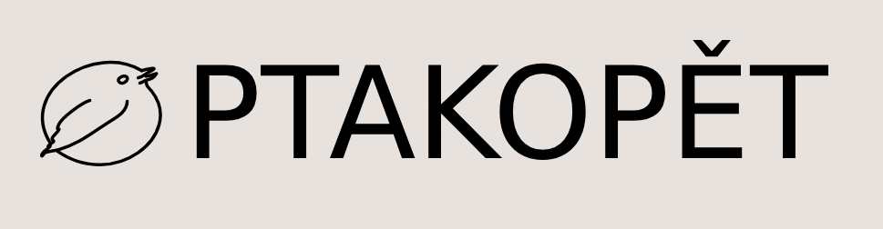

# Ptakopět

Ptakopět is a system for user friendly quality estimation [ptakopet.vilda.net](http://ptakopet.vilda.net). It can be used for translating texts to a language you are not really familiar with (outbound translation) or estimation the quality of your own translation (simple quality estimation).
- [Technical documentation](TECH.md)
- [User documentation](USER.md)
- [Future improvements](FUTURE.md)
- [Issues](ISSUES.md)