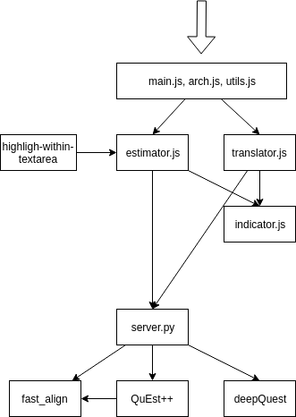

# Technical documentation

Ptakopět has two main components:
- frontend (defined in `web/`)
- backend (defined in `quality_estimation/`)

The top-level design and communication between all components is described in the following diagram:


## Frontend
The frontend is written in plain JavaScript with some minor help of jQuery.

### main.js
This file is the entry point of the frontend part. It binds variables to their HTML equivalents and boostraps other parts of the code. It starts with a check of HTTPS request, which is translated into HTTP, because of issues connected to Mixed Content policy ([ptakopet.vilda.net](http://ptakopet.vilda.net) has vaild SSL certificated installed, but some connected components do not).

### arch.js
This file registers events, that happen on the page and translates them to queries.

### utils.js
This file contains mostly minor textual helper functions, such as tokenizer, sorting permutation calculator and word index calculator).

### translator.js
This file was to some extent migrated from Ptakopět v1. It contains configs for translator backends (Khresmoi and Lindat MT Transformer supported at the moment) and system for relaying requests. We use redirect through [cors.io](https://cors.io) because of `Access Control Allow Origin` header not present in Khresmoi.

### indicator.js
This file only manages the indicators for translation and estimator requests. The former one may take up to several seconds to finish, so this part is vital for comfortable user experience.

### estimator.js
This file has similar structure to `translator.js`. It contains configs for estimator backends and a system for relaying such requests.

### highlight-within-textarea
This jQuery plugin by _lonekorean_ was forked to [github.com/zouharvi/highlight-within-textarea](https://github.com/zouharvi/highlight-within-textarea), as some minor changes to the internal workings of this plugin were necessary (dynamic style attribute instead of class based).

## Backend

The backends runs at [quest.ms.mff.cuni.cz/zouharvi](http://quest.ms.mff.cuni.cz/zouharvi). The main code runs in Python 3, but contains many interops (through system pipes) to other frameworks written in Python 2, Java, Perl, C++ etc.

### server.py

This is the entrypoint of the backend. It runs `BaseHTTPRequestHandler` and responds to requests for quality estimation and alignment. It is started with a positional argument specifying the port (80 by default). Possible requests and respective parameters are:
- `request=quality_estimation` returns the result of quality estimation model (either `quest++` or `deepQuest`) on values of `source` and `target` (all required)
- `request=align` returns the result of fast_align on values of `source` and `target` (both required)

### fast_align

Word alignment between sentences and their translations is necessary for Ptakopět itself as well as for QuEst++. Usage of this system is easy, but requires the input files to be stored in a very specific notation (1 tokenized sentence per line, source separated from the translation by `|||`). See [github.com/clab/fast_align](https://github.com/clab/fast_align).

The current use of fast_align is, however, insufficient, because it applies an unsupervised word-alignment method only to the single input sentence pair given. The model lacks any lexical knowledge and thus essentially provides a simple diagonal alignment. A better solution would be to use e.g. mgiza for applying a pre-trained word-alignment model, or to align a substantial number of sentence pairs along with the input one.

This module has to be build before using with CMake with the `build.sh` script.

### QuEst++

The main pipeline of QuEst++ consists of feature extraction and ML prediction. It was not designed for online purposes, so using it is quite cumbersome. The exctractor part is written in Java and the predictor in Python 2. The code is stored in `estimator.py` and `extract_driver.py`. Because of different frameworks, these programs are invoked with system pipes. See [github.com/ghpaetzold/questplusplus](https://github.com/ghpaetzold/questplusplus) and the respective fork at [github.com/zouharvi/questplusplus](https://github.com/zouharvi/questplusplus).

This system first extracts features [WMT12-13-14-17](https://www.quest.dcs.shef.ac.uk/quest_files/features_blackbox_baseline_17) from the input data, such as POS, occurences in a dictionary, length, etc and then runs a standard ML algorithm.

PERFORMANCE NOTE: This system was not designed to provide online results. The consequence is that especially the feature extraction part is not optimized and quite slow. It can also handle only 10 sentences at a time, so larger inputs are split into multiple batches.

### deepQuest

deepQuest takes neural approach to quality estimation. See [sheffieldnlp.github.io/deepQuest/](https://sheffieldnlp.github.io/deepQuest/). After making sure the requirements are fulfilled, copy the contents of `corpora/deepQuest` to `deepQuest`. Generally deepQuest provides much better results than QuEst++, but the output is binary (OK/BAD) and closely tied to the trained language (currently en-de).

DEVELOPMENT: In the first stages of deepQuest integration, the model contained [a bug](https://github.com/sheffieldnlp/deepQuest/issues/7), which prevented word-level inference on unseen data. Thanks to Frederic Blain this has been resolved.

PERFORMANCE NOTE: Because of a bug the inference requires at least two batches of input, so the actual input is duplicated `batch_size+1` times, slowing the whole process.

FUTURE NOTE: In future updates, this wrapper could take the `threshold` value as an argument (currently using 0.2), or return the actual probability (not feature of deepQuest so far).

### Installation

Running:

```
git clone https://github.com/zouharvi/ptakopet
cd ptakopet
git submodule update --init --recursive
```

should download all of the necessary files. Each subsystem (QuEst++ and deepQuest) have each very specific system requirements, hence see their respective documentation. (Note: QuEst++ requires `scikit-learn` to be version `0.15.2`. Newer versions include some API breaking changes.) The server can be launched (and subsequently detached) as:

```
cd v2/quality_estimation
nohup ./server.py 8080 &
```
